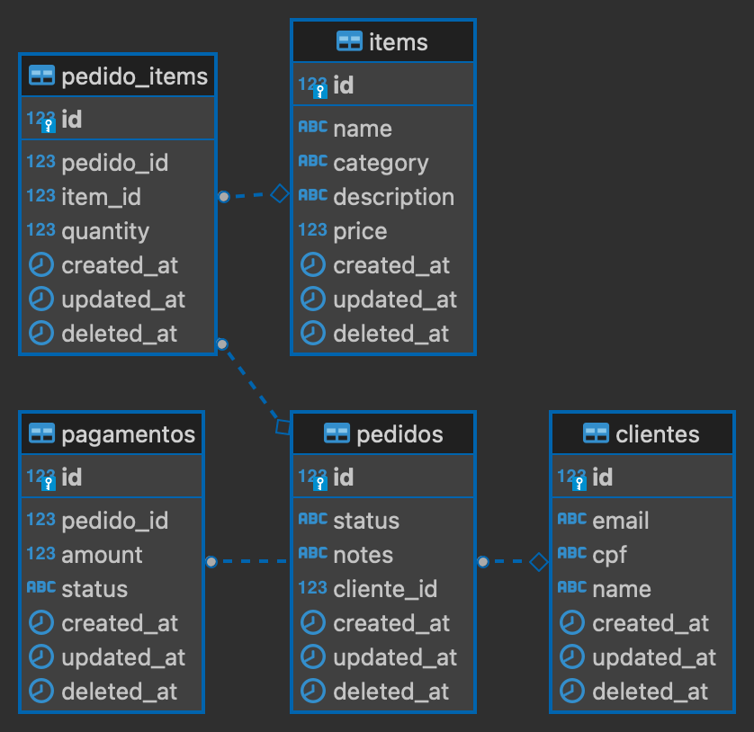

# POSTECH CHALLENGE SOAT2 GRUPO 16


<p align="center">
 <a href="#sobre">Sobre</a> •
 <a href="#entregas-fase-1">Entregas Fase 1</a> •
 <a href="#entregas-fase-2">Entregas Fase 2</a> •
 <a href="#domain-driven-development-event-storm">Sobre</a> •
 <a href="#interpretação-apis">Interpretação APIs</a> •
 <a href="#como-executar">Como Executar</a> •
 <a href="#como-executar-testes">Como Executar Testes</a> •
 <a href="#como-visualizar-o-swagger">Como Visualizar o Swagger</a> •
 <a href="#como-atualizar-o-swagger">Como Executar Testes</a> •
 <a href="#como-executar-utilizando-um-cluster-k8s-local">Como Executar Utilizando um Cluster K8S (local)</a> •
</p>

## Sobre
Projeto do curso de pós-graduação em Software Architecture da FIAP apresentado pelo Grupo 16 da Turma 2 de 01/2023.

Detalhes/Enúnciado: [Link](https://on.fiap.com.br/mod/conteudoshtml/view.php?id=314758&c=8960&sesskey=CSIu2psPsh)

Equipe/Contribuidores:
- Pedro Vitor Jhum Haramoto
- Jorge Eugenio Souza de Melo
- Joao Vitor Campari Racchetti
- Thiago Oliveira Camargo
- Rodrigo Luiz Pedroza Bezerra

### Entregas Fase 1

1. Documentação do sistema (DDD) utilizando a linguagem ubíqua, dos seguintes fluxos:
a. Realização do pedido e pagamento
b. Preparação e entrega do pedido

2. Uma aplicação para todo sistema de backend (monolito) que deverá ser desenvolvido seguindo os padrões apresentados nas aulas:
a. Utilizando arquitetura hexagonal
b. APIs:
    - Cadastro do Cliente
    - Identificação do Cliente via CPF
    - Criar, editar e remover de produto
    - Buscar produtos por categoria
    - Fake checkout, apenas enviar os produtos escolhidos para a fila
    - Listar os pedidos
c. Aplicação deverá ser escalável para atender grandes volumes nos horários de pico
d. Banco de dados a sua escolha
    - Inicialmente deveremos trabalhar e organizar a fila dos pedidos apenas em banco de dados

3. A aplicação deve ser entregue com um Dockerfile configurado para executá-la corretamente.
Para validação da POC, temos a seguinte limitação de infraestrutura:
a. 1 instância para banco de dados
b. 1 instâncias para executar aplicação

Não será necessário o desenvolvimento de interfaces para o frontend, o foco deve ser total no backend.

### Entregas Fase 2

1. Arquivos de configuração do Kubernetes:
    - Deployment da aplicação com ao menos 2 Pods.
    - Service para Load Balancer do tipo NLB ou ALB.
    - Configuração de acesso aos serviços da AWS parametrizados via secrets.
2. Atualizar a aplicação desenvolvida na FASE1 refatorando o código para seguir os padrões clean code e Clean Architecture.
3. Alterar/criar as APIs
    - Checkout do Pedido, que deverá receber os produtos solicitados e retornar a identificação do pedido.
    - Consultar status de pagamento do pedido, que informa se o pagamento foi aprovado ou não.
    - Webhook para receber confirmação de pagamento aprovado ou pagamento recusado.
    - A lista de pedidos deverá retornar os pedidos com suas descrições, ordenados por recebimento e por status
      com a seguinte prioridade: Pronto > Em Preparação > Recebido; Pedidos com status Finalizado não devem aparecer na lista.
    - Atualizar o status do pedido. 
    - Como desafio extra, opcionalmente, você pode implementar a integração com Mercado Pago para gerar o QR‐
      Code para pagamento e integrar com o WebHook para capturar os pagamentos.

### Entregas Fase 3
4. Justificativa da escolha do banco de dados utilizado.
   - Optamos pelo PostgreSQL no Amazon RDS para nosso projeto devido à sua confiabilidade comprovada e rica funcionalidade de desenvolvimento. Compatível com padrões SQL, oferece a flexibilidade necessária para nossas demandas de dados. Além disso, sendo uma opção de código aberto, se encaixa perfeitamente em nosso orçamento, especialmente no tier gratuito do Amazon RDS. A escalabilidade e a ativa comunidade de suporte garantem que nosso banco de dados cresça conforme nossas necessidades. Estamos confiantes de que o PostgreSQL no Amazon RDS é a escolha ideal para nosso projeto, proporcionando uma base sólida e confiável para nosso desenvolvimento.
   - Diagrama de banco de dados:
   - 

#### Domain Driven Development Event Storm

Abaixo o diagrama gerado durante o Event Storm e Dicionário de Linguagem Ubíqua, realizados como parte da entrega do projeto:


Também disponível [neste link](https://miro.com/app/board/uXjVMBVJX7I=/), com todas as etapas da dinâmica de grupo realizada, nesse caso, pode ser necessário solicitar permissão de acesso.

#### Interpretação APIs 

### Fase 1
Nessa seção, gostaríamos de descrever como interpretamos e realizamos a entrega dos requisitos (APIs) solicitados nesta fase:

- Cadastro do Cliente
    - É possível realizar o cadastro do cliente através do método `POST /clientes`, sendo que este pode ser realizado utilizando NOME (obrigatório) EMAIL (opcional) CPF (opcional);
- Identificação do Cliente via CPF
    - Caso o cliente opte por se identificar por CPF, é possível recupera-lo a partir desse dado `GET /clientes` utilizando o parâmetro opcional via `query`: "CPF"
- Criar, editar e remover de produto
    - CRUD de produtos disponível a partir dos métodos `GET`, `POST`, `PUT`e `DELETE`
- Buscar produtos por categoria
    - A busca de produtos possui o parâmetro opcional "category", trazendo todos os produtos com aquela categoria
- Fake checkout, apenas enviar os produtos escolhidos para a fila
    - O checkout (fake checkout no momento) realizamos através da atualização do status do pedido, que ao passar para o status `RECEBIDO`, pode ser recuperado na listagem a partir desse filtro opcional "status" no endpoint e possivelmente ser exibido em uma interface de cozinha para lista de preparação
- Listar os pedidos
    - A listagem de pedidos está disponível com filtro opcional de "status", conforme mencionado acima

### Fase 2
Nessa seção, gostaríamos de descrever como interpretamos e realizamos a entrega dos requisitos (APIs) solicitados nesta fase:
- Atualização do status do pedido
  - A atualização do status do pedido é realizada através do método `PATCH /pedidos/{id}`, onde é possivel passar o novo status do pedido.
- Webhook para notificação de pagamento do pedido
    - O webhook para notificação de pagamento do pedido é realizado através do método `POST /pedidos/mp-webhook`, onde é possível receber o retorno do pagamento e atualizar o status do pedido para `PAGO`
    #### JSON de exemplo:
    ````
      {
        "id": 12345,
        "live_mode": true,
        "type": "payment",
        "date_created": "2015-03-25T10:04:58.396-04:00",
        "user_id": 44444,
        "api_version": "v1",
        "action": "payment.created",
        "data": {
            "id": "1" // Este campo por enquanto será a referencia do ID do pedido.
        }
    }
    ````
- Criação de QR code para pedido
  - A criação do QR code para pedido é realizada através do método `GET /pedidos/{id}/qr-code`, onde é possível receber o retorno do QR code para pagamento do pedido.
  - No retorno voltara um código que poderá renderizar uma imagem a partir dele em qualquer site como: https://www.qr-code-generator.com/
- Ordenação na lista de Pedidos - `GET /pedidos`
    - Ordena por `created_at` - recebimento/criação do pedido;
    - Ordena por `status`, onde `Pronto > Em Preparação > Recebido`;
    - Não lista os pedidos com status `Finalizado`.
- Consultar status do pagamento do pedido
  - A consulta do status do pagamento do pedido é realizada através do método `GET /pedidos/{id}/pagamentos/status`, onde é possível receber o retorno do status do pagamento do pedido.
  - Caso volte 404, é necessário que faça a criação de um novo pagamento utilizando o webhook.
  
Para mais informações sobre contratos/API, é possível acessar através do swagger, como mencionado na seção [como visualizar o swagger](#como-visualizar-o-swagger).
- Execução do ambiente no K8S: [Como Executar Utilizando um Cluster K8S (local)](#como-executar-utilizando-um-cluster-k8s-local)

## Como Executar

Um makefile é disponibilizado para ajudar com algumas atividades rotineiras, para checar a lista de receitas disponíveis, basta acessar o [makefile aqui](./Makefile) ou simplesmente, na raiz do projeto, executar o comando `make help`.

Execute `make build-all` e em seguida `make run-all`, para executar todas as imagens necessárias e subir o projeto localmente. Caso deseje executar somente o banco de dados, é possível através da receita `make run-db` (também após o `make build-all`).

## Como Executar Testes

Esse projeto atualmente possui testes unitários e de integração, para executar todos, é necessário que ao menos o container do banco de dados esteja disponível (para saber como, veja a seção: [Como Executar](#como-executar)).

Após isso, basta executar o comando `make test`, que fará com que a base de dados atual seja recriada (para execução dos testes de integração) e os testes sejam executados.

## Como Executar Linter

Para executar os linters, é necessário ter instalada, localmente, a ferramenta `golangci`. Disponível [neste link](https://golangci-lint.run/usage/install/).

Para executar, basta utilizar o comando `make lint`, que executará o comando com o parâmetro de autofix. Ou então o comando `make ci`, que executará os testes e o linter.

## Como Visualizar o Swagger

Este projeto conta com Swagger para especificação e documentação da API. Para visualizar, basta executar localmente o projeto, como indicado na seção [Como Executar](#como-executar). E então acessar o link abaixo:

`http://localhost:8000/swagger/index.html`

## Como Atualizar o Swagger

Para atualizar o Swagger após a criação de um novo endpoint ou alteração de um endpoint existente, basta executar as anotações conforma a [documentação](https://github.com/swaggo/http-swagger#a-practical-example) do `swag`. E em seguida, executar a receita do makefile conforme o exemplo abaixo:

`make update-docs`

## Como Executar Utilizando um Cluster K8S (local)

Para executar a aplicação em ambiente clusterizado é necessário provisionar o Docker, Minikube e Kubectl.
- Guia de instalação do [Docker](https://docs.docker.com/engine/install/)
- Guia de instalação do [Minikube](https://minikube.sigs.k8s.io/docs/start/)
- Guia de instalação do [Kubectl](https://kubernetes.io/docs/tasks/tools/)

Após instalação, inicie um cluster:
- `minikube start`

Com o cluster disponível, execute no diretório raíz:
- `kubectl apply -f k8s.yml --insecure-skip-tls-verify`
- Observação: o uso do insecure-skip-tls-verify é necessário para execução local, pois o certificado utilizado na criação QR Code é auto-assinado.

Para executar o load-balancer (opcional para execução local):
- `kubectl apply -f k8s-load-balancer.yml`

Acesse o container do banco de dados e execute as migrations:
- `kubectl get pods`
- `make migrate-k8s`
- `make seeds-k8s`

Acesse a aplicação:
- `curl --location 'http://localhost/clientes'`

A depender da configuração do seu ambiente de desenvolvimento, será necessário executar um port-forwarding para acessar a aplicação:
- `kubectl port-forward service/fast-food-app-service 8000:80`
- `curl --location 'http://localhost:8000/clientes'`
